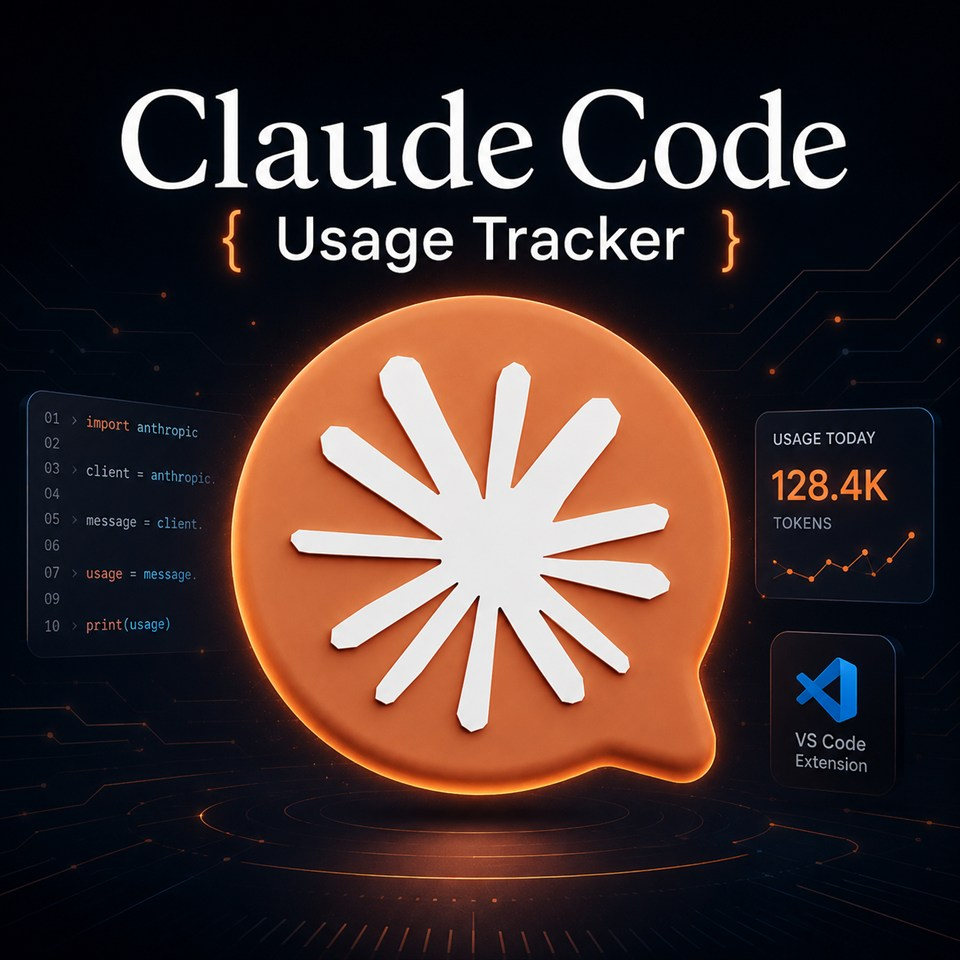
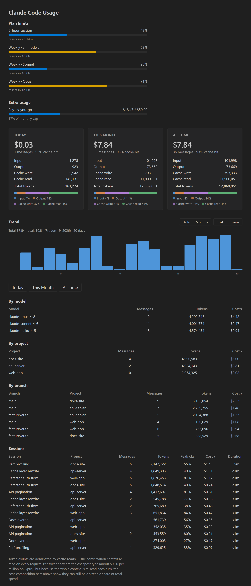

<p align="center">
  
</p>

<p align="center">
  A VS Code / Cursor extension that surfaces your Claude Code plan-limit usage,
  context window, token counts, estimated cost, and usage trends from your local
  logs &mdash; in the status bar and a dashboard.
</p>

<p align="center">
  
</p>

<p align="center">
  <sub>Plan limits, context, cost, and tokens at a glance &mdash; right in the editor status bar.</sub>
</p>

<p align="center">
  
</p>

## Features

- **Status bar** &mdash; plan-limit utilization (5-hour + weekly, optional weekly-Opus), each led by a Claude sunburst that turns green / yellow / red as Claude flags that window, plus the current session's context-window fill, today's estimated cost, and token count. Each segment toggles independently. Click any of them to open the dashboard.
- **Plan limits** &mdash; real 5h / weekly usage with reset times and per-model scoped windows, shown as bars in the dashboard. Fetched live from Anthropic's usage endpoint (the same call Claude Code makes) so the numbers stay current even mid-session, with Claude Code's on-disk cache as a fallback.
- **Extra usage (pay-as-you-go)** &mdash; optional, **off by default**: when your account has pay-as-you-go enabled, your spend beyond plan limits is shown in the status bar (`extra $3.50 / $50.00`), the tooltip, and the dashboard. Turn on with `showExtraUsage`.
- **Context window** &mdash; the latest request's prompt size as a percent of the model's window (like `/context`), with 1M-tier detection.
- **Dashboard** &mdash; Today / This Month / All Time cards with a full input / output / cache-write / cache-read token breakdown, cache-hit rate, and a cost-composition bar. Below them, sortable breakdowns: **by model**, **by project** (grouped by git repo, folder, or path), **by git branch**, and **by session** (titles, peak context, active-time duration).
- **Trend** &mdash; a bar chart of usage over time: daily across the current month or monthly across all time, switchable between cost and tokens, with the current day highlighted and a running total / peak summary. Empty days and months are filled in, so gaps in usage stay visible.
- **Live updates** &mdash; file watchers over your logs and the limits cache refresh the moment Claude Code writes, with a timer as a fallback.
- **Cost estimates** &mdash; from a per-model price table, with prefix matching for dated and suffixed model ids.

## How it works

Claude Code writes a JSONL transcript per session under `~/.claude/projects`. The
extension walks those logs and parses each line into a per-message usage record
&mdash; capturing model, working directory, git branch, and session id &mdash;
deduplicating the entries that repeat once per content block. Records are
aggregated by day, month, and all-time, and grouped by model, project, branch,
and session, then priced with a per-model rate table. The daily and monthly
aggregates feed the trend chart; the rest feed the cards and breakdown tables.

Plan limits come from a second source. By default the extension fetches them
**live** from Anthropic's usage endpoint (`GET /api/oauth/usage` on
`api.anthropic.com`) &mdash; the same call Claude Code makes &mdash; authenticated
with the OAuth token in `~/.claude/.credentials.json`. This keeps the 5-hour and
weekly figures current even during a long session, when Claude Code's own on-disk
cache (`~/.claude/usage-cache.json`) can sit hours stale. If the live request
fails for any reason, the extension falls back to that cache file; a window whose
reset time has already passed is shown as `—` (muted) with an "Updated X ago"
note so a stale reading is never styled like a live one. The utilization figures
are already 0&ndash;100, so they're shown as-is, mirroring the server's severity
for the warning tint. The context-window figure is the most recent request's
prompt size (input + cache) over the model's window &mdash; 200K, or 1M when the
prompt or model marks the long-context tier.

**Privacy.** The live fetch reads your OAuth token from
`~/.claude/.credentials.json` (honoring `CLAUDE_CONFIG_DIR`) **read-only** &mdash;
it is never written back &mdash; and talks only to Anthropic's own hosts
(`api.anthropic.com` for usage, and `platform.claude.com` only if the token needs
refreshing, which is held in memory). Set `useLiveApi` to `false` to read only
the local cache file and make no network requests.

If your account has pay-as-you-go **extra usage** enabled, that same usage
response carries your spend beyond plan limits. With `showExtraUsage` on (it is
**off by default**), the extension shows it as `extra <spent> / <cap>` in the
status bar and an Extra usage section in the dashboard. Amounts come straight
from Anthropic (minor units + currency); nothing is shown when your account has
extra usage disabled.

## Settings

| Setting | Default | Description |
| --- | --- | --- |
| `claudeCodeUsageTracker.refreshIntervalSeconds` | `30` | How often to refresh usage data. |
| `claudeCodeUsageTracker.currency` | `USD` | Currency code for cost formatting. |
| `claudeCodeUsageTracker.decimalPlaces` | `2` | Decimal places for cost figures. |
| `claudeCodeUsageTracker.showLimits` | `true` | Show 5-hour and weekly plan-limit utilization. |
| `claudeCodeUsageTracker.useLiveApi` | `true` | Fetch current limits live from Anthropic's usage endpoint (using the local OAuth token); falls back to the cache file on failure. Turn off to read only the cache. |
| `claudeCodeUsageTracker.liveApiMinIntervalSeconds` | `180` | Minimum seconds between live usage-endpoint requests. Throttles network calls only; the status bar still refreshes on its normal interval. |
| `claudeCodeUsageTracker.showOpusWeekly` | `false` | Also append the weekly Opus limit (`opus NN%`) when a live Opus window exists. |
| `claudeCodeUsageTracker.showContext` | `true` | Show the current session's context-window fill (like `/context`). |
| `claudeCodeUsageTracker.showCost` | `true` | Show today's estimated cost. |
| `claudeCodeUsageTracker.showTokens` | `true` | Show today's token count. |
| `claudeCodeUsageTracker.showExtraUsage` | `false` | Show pay-as-you-go extra usage (spend beyond plan limits) in the status bar and dashboard. Only appears when your account has extra usage enabled. |
| `claudeCodeUsageTracker.projectGroupingMode` | `git` | Group the dashboard's By project breakdown by git repo, folder, or path. |

## Troubleshooting

**The dashboard or status bar is empty.**
Claude Code has to have been installed and used at least once &mdash; the
extension reads the JSONL transcripts it writes under `~/.claude/projects`. If
that folder doesn't exist or has no sessions yet, there's nothing to show.

**Plan-limit bars don't appear.**
The 5-hour / weekly figures are fetched live from Anthropic using the OAuth token
in `~/.claude/.credentials.json`, falling back to `~/.claude/usage-cache.json`. If
neither is available, run Claude Code once (and sign in) so the credentials and
cache exist. The status-bar segments also honor the `showLimits` setting and only
appear while a limit window is live. Set `useLiveApi` to `false` to use the cache
file only.

**Extra usage (pay-as-you-go) doesn't show.**
It is **off by default** &mdash; turn on `showExtraUsage`. Even then it only
appears when your Anthropic account actually has pay-as-you-go enabled (the API
reports `extra_usage.is_enabled`); if your account has no extra usage, there is
nothing to display.

**Usage history is missing older days or months.**
Claude Code automatically deletes conversation logs older than `cleanupPeriodDays`
(default **30 days**), and once deleted they can't be recovered. To keep more
history, add this to `~/.claude/settings.json`:

```json
{ "cleanupPeriodDays": 365 }
```

This only affects logs kept from now on; already-deleted sessions can't be
restored.

**Token counts look lower than your provider's dashboard.**
Tokens and cost are reconstructed from local logs and are an estimate. Sub-agents
and background workflows write their own `.jsonl` files in sub-directories &mdash;
the extension reads them, but some proxy setups don't record agent-level usage,
so the totals here can run lower than the upstream count. Your real spend is
always on your provider's billing page.

**Numbers look stale.**
The extension refreshes when Claude Code writes to its logs, with a timer
fallback (`refreshIntervalSeconds`). To force an update, run **Claude Code Usage
Tracker: Refresh** from the Command Palette.

## Development

```bash
npm install --include=dev   # install dev dependencies
npm run compile             # type-check + build to ./out
# then press F5 in VS Code / Cursor to launch the Extension Development Host
```

`npm run watch` keeps the compiler running while you work.

## Changelog

See [CHANGELOG.md](./CHANGELOG.md) for the full, dated history. The latest entry
covers plan-limit tracking, the context-window indicator, the dashboard cards and
sortable breakdowns, and the usage-trend chart added in this release.

## License

MIT &mdash; see [LICENSE](./LICENSE).
