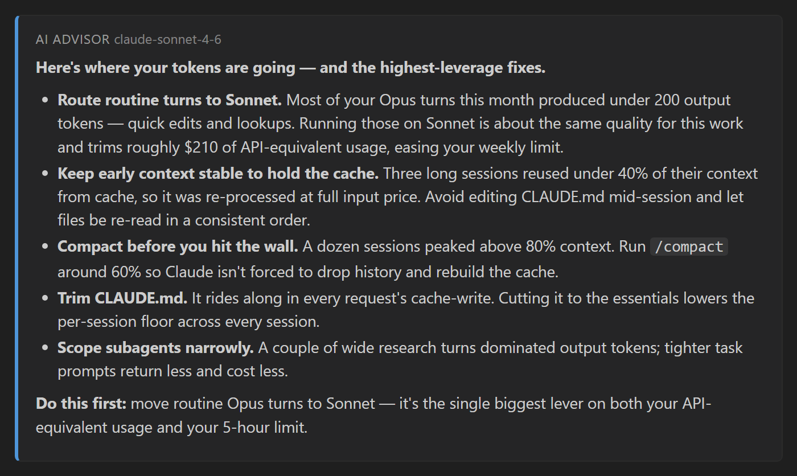
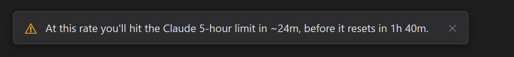

<p align="center">
  
</p>

<p align="center">
  A VS Code / Cursor extension that surfaces your Claude Code plan-limit usage,
  context window, token counts, estimated cost, and usage trends from your local
  logs &mdash; in the status bar and a dashboard.
</p>

<p align="center">
  
</p>

<p align="center">
  <sub>At a glance in the status bar &mdash; plan limits, context, cost, and tokens. The pace meter <code>5h 42% &rarr; 53%</code> reads &ldquo;at your current rate you're on track to finish the 5&#8209;hour window at <b>53%</b>.&rdquo;</sub>
</p>

<p align="center">
  
</p>

## Features

- **Status bar** &mdash; plan-limit utilization (5-hour + weekly, optional weekly-Opus), each led by a Claude sunburst that turns green / yellow / red as Claude flags that window, plus the current session's context-window fill, today's estimated cost, and token count. Each segment toggles independently. Click any of them to open the dashboard.
- **Plan limits** &mdash; real 5h / weekly usage with reset times and per-model scoped windows, shown as bars in the dashboard. Fetched live from Anthropic's usage endpoint (the same call Claude Code makes) so the numbers stay current even mid-session, with Claude Code's on-disk cache as a fallback.
- **Predictive alerts** &mdash; forecasts when you'll hit a limit and warns you before you do. The 5-hour limit gets a live **pace meter**: `5h 42% → 53%` means *at your current rate you're on track to finish the 5-hour window at 53%* (it climbs toward 100% as you push harder, so you can see at a glance whether you're cruising or about to run out). The weekly limit shows a time-to-limit **ETA** only when you're genuinely on track to breach it. **Notifications** fire at configurable thresholds (75% / 90%) and when your pace is about to breach a window before it resets, and the tooltip shows your live **burn rate** (tokens/min, cost/min). An optional, off-by-default **model-cost advisor** suggests a cheaper model when you're burning an expensive one on routine turns. On by default and 100% local &mdash; configure under `predictiveAlerts.*`.
- **Extra usage (pay-as-you-go)** &mdash; optional, **off by default**: when your account has pay-as-you-go enabled, your spend beyond plan limits is shown in the status bar (`extra $3.50 / $50.00`), the tooltip, and the dashboard. Turn on with `showExtraUsage`.
- **Context window** &mdash; the latest request's prompt size as a percent of the model's window (like `/context`), with 1M-tier detection.
- **Advisor** &mdash; a panel in the dashboard with ranked, money-quantified tips to cut waste this month: routing routine turns to a cheaper model (with the estimated saving), long sessions that re-processed context uncached, sessions running near the context limit, and a month-end spend forecast. **Subscription-aware:** on a Pro/Max plan (where you pay a flat fee, not per token) it labels the dollar figures as *estimated API-equivalent usage* &mdash; a gauge, not a bill &mdash; and frames the advice around your 5-hour / weekly session limits. Computed entirely from your local usage data &mdash; no network call, no API key, and your prompts never leave your machine. On by default; turn it off with `advisor.enabled`. An optional **Explain with AI** button turns those signals into written, prioritized coaching &mdash; it calls Anthropic with **your own API key** &mdash; a pay-as-you-go key from the [Anthropic Console](https://console.anthropic.com/settings/keys), separate from your Claude Code subscription &mdash; stored in VS Code Secret Storage (set via the *Set Anthropic API Key* command, which links you straight to the console), sends only the usage summary by default, and never uses your Claude Code login. Prompt text is included only if you opt in (`advisor.ai.includePrompts`) and confirm.
- **Dashboard** &mdash; Today / This Month / All Time cards with a full input / output / cache-write / cache-read token breakdown, cache-hit rate, and a cost-composition bar. Below them, sortable breakdowns: **by model**, **by project** (grouped by git repo, folder, or path), **by git branch**, and **by session** (titles, peak context, active-time duration).
- **Trend** &mdash; a bar chart of usage over time: daily across the current month or monthly across all time, switchable between cost and tokens, with the current day highlighted and a running total / peak summary. Empty days and months are filled in, so gaps in usage stay visible.
- **Live updates** &mdash; file watchers over your logs and the limits cache refresh the moment Claude Code writes, with a timer as a fallback.
- **Cost estimates** &mdash; from a per-model price table, with prefix matching for dated and suffixed model ids.

## How it works

Claude Code writes a JSONL transcript per session under `~/.claude/projects`. The
extension walks those logs and parses each line into a per-message usage record
&mdash; capturing model, working directory, git branch, and session id &mdash;
deduplicating the entries that repeat once per content block. Records are
aggregated by day, month, and all-time, and grouped by model, project, branch,
and session, then priced with a per-model rate table. The daily and monthly
aggregates feed the trend chart; the rest feed the cards and breakdown tables.

Plan limits come from a second source. By default the extension fetches them
**live** from Anthropic's usage endpoint (`GET /api/oauth/usage` on
`api.anthropic.com`) &mdash; the same call Claude Code makes &mdash; authenticated
with the OAuth token in `~/.claude/.credentials.json`. This keeps the 5-hour and
weekly figures current even during a long session, when Claude Code's own on-disk
cache (`~/.claude/usage-cache.json`) can sit hours stale. If the live request
fails for any reason, the extension falls back to that cache file; a window whose
reset time has already passed is shown as `—` (muted) with an "Updated X ago"
note so a stale reading is never styled like a live one. The utilization figures
are already 0&ndash;100, so they're shown as-is, mirroring the server's severity
for the warning tint. The context-window figure is the most recent request's
prompt size (input + cache) over the model's window &mdash; 200K, or 1M when the
prompt or model marks the long-context tier.

**Privacy.** The live fetch reads your OAuth token from
`~/.claude/.credentials.json` (honoring `CLAUDE_CONFIG_DIR`) **read-only** &mdash;
it is never written back &mdash; and talks only to Anthropic's own hosts
(`api.anthropic.com` for usage, and `platform.claude.com` only if the token needs
refreshing, which is held in memory). Set `useLiveApi` to `false` to read only
the local cache file and make no network requests.

The **Advisor** panel is computed entirely on-device. Its optional **Explain with
AI** button is the one feature that sends data off-device, and only when you click
it: it POSTs your usage summary to `api.anthropic.com/v1/messages` authenticated
with **your own** Anthropic API key &mdash; created at
[console.anthropic.com/settings/keys](https://console.anthropic.com/settings/keys)
(a pay-as-you-go API key, separate from and billed independently of your Claude Code
subscription) and kept in VS Code Secret Storage, never the Claude Code OAuth token. By default only metadata is sent &mdash; token counts,
costs, cache figures, model names, and the locally-computed tips, never any prompt
or response text. Prompt text is included only if you both turn on
`advisor.ai.includePrompts` and confirm the modal each time, in which case a small,
truncated sample of recent prompts is added so it can coach on prompt quality. The
key is read locally and never leaves your machine; it is never bundled with the
extension or shared with anyone else.

<p align="center">
  
</p>

<p align="center">
  <sub>&ldquo;Explain with AI&rdquo; turns the local signals into prioritized, written coaching &mdash; called with your own API key, framed around your plan limits when you're on a subscription.</sub>
</p>

If your account has pay-as-you-go **extra usage** enabled, that same usage
response carries your spend beyond plan limits. With `showExtraUsage` on (it is
**off by default**), the extension shows it as `extra <spent> / <cap>` in the
status bar and an Extra usage section in the dashboard. Amounts come straight
from Anthropic (minor units + currency); nothing is shown when your account has
extra usage disabled.

**Predictive alerts** turn those limit figures into a forecast, computed from your
*average* consumption over the current window so far (`resets_at` minus the window's
length gives the start), so each window is judged on its own timescale &mdash; the
5-hour window over hours, the 7-day window over days &mdash; and a single percentage
tick can't manufacture an alarming number. The **5-hour** window shows a live pace
meter: the projected end-of-window utilization at your current rate (`5h 24% → 48%`),
climbing toward 100% as you burn faster. The **weekly** window stays quiet and shows
a time-to-limit ETA only once you're on a trustworthy track to breach it before reset
(its figure moves over days, so a constant readout would be noise). Threshold and
pace-based **warnings** fire once per window (re-arming when it resets) and only while
you're actually burning, so an idle window never nags. It all runs on the figures
already on screen and makes no extra network calls.

<p align="center">
  
</p>

<p align="center">
  <sub>A heads-up before you run out &mdash; fired only when you're genuinely on pace to hit a limit.</sub>
</p>

## Getting started

1. **Install** from the VS Code Marketplace or [Open VSX](https://open-vsx.org), or
   download a `.vsix` from the
   [Releases](https://github.com/wheelbarrel00/ClaudeCodeUsageTracker/releases) page
   and run `code --install-extension <file>.vsix` (or, in Cursor,
   `cursor --install-extension <file>.vsix`).
2. **Use Claude Code at least once** so it writes its logs under `~/.claude`. The
   extension reads them automatically &mdash; nothing to configure for the status
   bar, dashboard, and limits to populate.
3. **Sign in to Claude Code** (so `~/.claude/.credentials.json` exists) for live,
   always-current plan limits; without it, the extension falls back to Claude Code's
   on-disk cache.
4. The status bar fills in on the next refresh. Click any segment, or run **Claude
   Code Usage Tracker: Show Dashboard** from the Command Palette, to open the
   dashboard. **Predictive alerts are on by default** &mdash; tune them under
   `predictiveAlerts.*`, or turn them off with `predictiveAlerts.enabled`.

## Settings

| Setting | Default | Description |
| --- | --- | --- |
| `claudeCodeUsageTracker.refreshIntervalSeconds` | `30` | How often to refresh usage data. |
| `claudeCodeUsageTracker.currency` | `USD` | Currency code for cost formatting. |
| `claudeCodeUsageTracker.decimalPlaces` | `2` | Decimal places for cost figures. |
| `claudeCodeUsageTracker.showLimits` | `true` | Show 5-hour and weekly plan-limit utilization. |
| `claudeCodeUsageTracker.useLiveApi` | `true` | Fetch current limits live from Anthropic's usage endpoint (using the local OAuth token); falls back to the cache file on failure. Turn off to read only the cache. |
| `claudeCodeUsageTracker.liveApiMinIntervalSeconds` | `180` | Minimum seconds between live usage-endpoint requests. Throttles network calls only; the status bar still refreshes on its normal interval. |
| `claudeCodeUsageTracker.showOpusWeekly` | `false` | Also append the weekly Opus limit (`opus NN%`) when a live Opus window exists. |
| `claudeCodeUsageTracker.showContext` | `true` | Show the current session's context-window fill (like `/context`). |
| `claudeCodeUsageTracker.showCost` | `true` | Show today's estimated cost. |
| `claudeCodeUsageTracker.showTokens` | `true` | Show today's token count. |
| `claudeCodeUsageTracker.showExtraUsage` | `false` | Show pay-as-you-go extra usage (spend beyond plan limits) in the status bar and dashboard. Only appears when your account has extra usage enabled. |
| `claudeCodeUsageTracker.projectGroupingMode` | `git` | Group the dashboard's By project breakdown by git repo, folder, or path. |
| `claudeCodeUsageTracker.advisor.enabled` | `true` | Show the Advisor panel in the dashboard: ranked, money-quantified tips to cut waste (cheaper-model routing, cache reuse, context bloat, spend forecast). Fully local; nothing leaves your machine. |
| `claudeCodeUsageTracker.advisor.ai.model` | `claude-sonnet-4-6` | Model used by the Advisor's "Explain with AI" button (called with your own API key). Sonnet is a low-cost default; use an Opus id for deeper analysis. |
| `claudeCodeUsageTracker.advisor.ai.includePrompts` | `false` | When using "Explain with AI", also send a small, truncated sample of your recent prompts so it can coach on prompt quality. Off by default (metadata only); you confirm each time prompts would be included. |
| `claudeCodeUsageTracker.predictiveAlerts.enabled` | `true` | Master switch for predictive alerts (ETA, warnings, advisor). |
| `claudeCodeUsageTracker.predictiveAlerts.showFiveHourEta` | `true` | Show the 5-hour pace meter (projected end-of-window %, e.g. `5h 24% → 48%`) in the status bar. |
| `claudeCodeUsageTracker.predictiveAlerts.showWeeklyEta` | `true` | Show the weekly ETA, but only when you're on track to hit the weekly limit before it resets. |
| `claudeCodeUsageTracker.predictiveAlerts.warnThresholds` | `[75, 90]` | Utilization percentages that fire a warning notification (once per window each). |
| `claudeCodeUsageTracker.predictiveAlerts.predictBreach` | `true` | Also warn when your current pace projects you'll hit a limit before it resets. |
| `claudeCodeUsageTracker.predictiveAlerts.windowMinutes` | `15` | Trailing window for the burn-rate readout (tokens/min, cost/min) in the tooltip. |
| `claudeCodeUsageTracker.predictiveAlerts.modelAdvisor.enabled` | `false` | One-time, dismissible hint suggesting a cheaper model when recent turns spend heavily on an expensive one for little output. |

## Troubleshooting

**The dashboard or status bar is empty.**
Claude Code has to have been installed and used at least once &mdash; the
extension reads the JSONL transcripts it writes under `~/.claude/projects`. If
that folder doesn't exist or has no sessions yet, there's nothing to show.

**Plan-limit bars don't appear.**
The 5-hour / weekly figures are fetched live from Anthropic using the OAuth token
in `~/.claude/.credentials.json`, falling back to `~/.claude/usage-cache.json`. If
neither is available, run Claude Code once (and sign in) so the credentials and
cache exist. The status-bar segments also honor the `showLimits` setting and only
appear while a limit window is live. Set `useLiveApi` to `false` to use the cache
file only.

**Extra usage (pay-as-you-go) doesn't show.**
It is **off by default** &mdash; turn on `showExtraUsage`. Even then it only
appears when your Anthropic account actually has pay-as-you-go enabled (the API
reports `extra_usage.is_enabled`); if your account has no extra usage, there is
nothing to display.

**Usage history is missing older days or months.**
Claude Code automatically deletes conversation logs older than `cleanupPeriodDays`
(default **30 days**), and once deleted they can't be recovered. To keep more
history, add this to `~/.claude/settings.json`:

```json
{ "cleanupPeriodDays": 365 }
```

This only affects logs kept from now on; already-deleted sessions can't be
restored.

**Token counts look lower than your provider's dashboard.**
Tokens and cost are reconstructed from local logs and are an estimate. Sub-agents
and background workflows write their own `.jsonl` files in sub-directories &mdash;
the extension reads them, but some proxy setups don't record agent-level usage,
so the totals here can run lower than the upstream count. Your real spend is
always on your provider's billing page.

**Numbers look stale.**
The extension refreshes when Claude Code writes to its logs, with a timer
fallback (`refreshIntervalSeconds`). To force an update, run **Claude Code Usage
Tracker: Refresh** from the Command Palette.

**No forecast (`→ 48%` or `· ~38m`) shows next to a limit.**
The **5-hour pace meter** (`5h 24% → 48%`) appears once you've used the window a
little and at least ~10% of its 5 hours has elapsed &mdash; before that there isn't
enough to project from, so you'll see just `5h 24%`. The **weekly** ETA is shown only
when you're on a trustworthy track to breach the weekly limit before it resets (its
figure moves over days, so a constant readout would be noise) &mdash; the rest of the
time it's just `wk 9%`, which is expected, not a missing reading. Turn either off with
`predictiveAlerts.showFiveHourEta` / `predictiveAlerts.showWeeklyEta`, or the whole
feature with `predictiveAlerts.enabled`.

**I'm not getting limit warnings.**
Warnings need `predictiveAlerts.enabled` on (the default). A threshold warning fires
once when a window crosses each value in `predictiveAlerts.warnThresholds` (75% / 90%
by default) and re-arms when the window resets &mdash; so if you've already crossed it
this window, it won't fire again until reset. The predictive "you'll hit it before
reset" warning needs `predictiveAlerts.predictBreach` on and only fires once you're
genuinely on track to breach and actively burning. (Notifications auto-dismiss; check
the bell / Notifications center if you may have missed one.)

**A "cheaper model" hint appeared, or I want one.**
That's the model-cost advisor, which is **off by default**. Turn it on with
`predictiveAlerts.modelAdvisor.enabled`. It's deliberately rare &mdash; it only speaks
up when recent turns show heavy spend on an expensive model for little output, at most
once every few hours, and it has a **Don't show again** button.

**"Explain with AI" asks for an API key — where do I get one?**
That button uses the Anthropic **API** (pay-as-you-go), which is **separate** from
your Claude Code / claude.ai Pro/Max subscription &mdash; the subscription can't be
used for it. Create a key at
[console.anthropic.com/settings/keys](https://console.anthropic.com/settings/keys)
(Anthropic Console → Settings → API keys); it starts with `sk-ant-`. Running **Set
Anthropic API Key** offers an *Open Anthropic Console* button that takes you there.
The key is stored in VS Code Secret Storage and used only for this feature; each
explanation is a single API call (cents on Sonnet) billed to that key. Clear it
anytime with **Clear Anthropic API Key**. The rest of the extension &mdash; status
bar, dashboard, limits, the local Advisor tips &mdash; needs no API key.

**A subscription (Pro/Max) isn't enough for the API by itself &mdash; HTTP 400
"credit balance is too low".** The Anthropic **API** is pay-as-you-go and
**separate** from your Claude Code / claude.ai subscription and its session limits.
Your `sk-ant-` key is valid, but its API account has no credit &mdash; a Pro/Max plan
does not include API credit, and the subscription login can't be used to power
third-party AI calls. Add a little credit at
[console.anthropic.com → Billing](https://console.anthropic.com/settings/billing),
then try again. (It's only cents per explanation.)

## Development

```bash
npm install --include=dev   # install dev dependencies
npm run compile             # type-check + build to ./out
# then press F5 in VS Code / Cursor to launch the Extension Development Host
```

`npm run watch` keeps the compiler running while you work.

## Changelog

See [CHANGELOG.md](./CHANGELOG.md) for the full, dated history. The latest release
adds **predictive alerts** &mdash; a time-to-limit ETA, threshold and pace-based
warnings, a burn-rate readout, and an optional model-cost advisor.

## License

MIT &mdash; see [LICENSE](./LICENSE).
